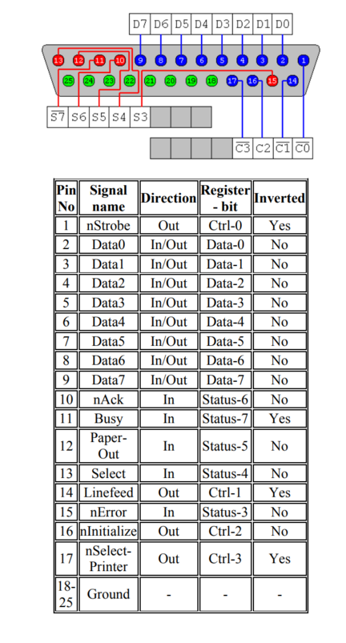

Using a parallel port to record button presses
==============================================

`Time-stamp: <2024-12-03 14:47:18 christophe@pallier.org>`


Parallel ports are ancient (and essentially obsolete) devices initialy used for communication between computers and printers. They make it relatively easy to read or write digital signals ([TTL](https://en.wikipedia.org/wiki/Transistor%E2%80%93transistor_logic)). Physically, they expose a DB25 connector, consisting of 25 pins, some of which can read/write bits. From the programmer point of view, a parallel port is seen as three 8-bits registers --- named  `data`, `status` and `control`. The bits inside these registers directly map onto the pins, as shown on the following figure:



(see <http://www.labbookpages.co.uk/electronics/parallelPort.html> for more details)

A computer can host several parallel ports. Each is associated with 3 successive IO addresses (ammping onto the registers). It used to be necessary to know the physical address of the ports to program them, but this is no lponger the case in OS like Linux that expose  parallel ports as devices.

At the Neurospin MEG center, eight response buttons are connected to several parallel ports, using only their status registers. Below is the listing of a Python code that detects button press events. Note the dictionary that specifies the mapping betwwen response button and bits in the status registers of various ports.


```python
""" Code to detect press event on the forp response keypads at the MEG/Neurospin

Requirements: 
   pyparallel (https://github.com/pyserial/pyparallel/tree/master)

Note:
    This code only works under Linux (to use it under Windows, you would need to modify the names of the parallel ports devices)

christophe@pallier.org & julie.bonnaire@outlook.fr
"""

from parallel import Parallel
from dataclasses import dataclass

@dataclass
class PortBit:
    port:int
    bit: int

# Each button is associated to a (parallel_port, bit)

mapping_buttons_parallelports = {  # Each button is associated to a (port, bit)         
'leftBlue': PortBit(2, 6),
'leftYellow': PortBit(0, 4),
'leftGreen': PortBit(0, 3),
'leftRed': PortBit(0, 5),
'rightBlue' :  PortBit(0, 6),
'rightYellow' : PortBit(1, 6),
'rightGreen' : PortBit(1, 5),
'rightRed' : PortBit(1, 4),
}


# Parallel port initialization
p0 = Parallel("/dev/parport0")
p1 = Parallel("/dev/parport1")
p2 = Parallel("/dev/parport2")
p3 = Parallel("/dev/parport3")  # a priori useless for response buttons


def get_pp_status():
    return [p0.PPRSTATUS(), p1.PPRSTATUS(), p2.PPRSTATUS(), p3.PPRSTATUS()]

def get_buttons_state(pp_status):
    states = {}
    for button, a in mapping_buttons_parallelports.items():
        states[button] = pp_status[a.port] &  2**a.bit == 2**a.bit
        
    return states
    

if __name__ == '__main__':
    old_pp_st =  get_pp_status()
    while True: 
        pp_st = get_pp_status()
        if pp_st != old_pp_st:
            print([bin(x) for x in pp_st])
            for b, v in get_buttons_state(pp_st).items():
                if v:
                    print(b)

        old_pp_st = pp_st


```

Note: A more general code would allow the use of the other registers (data and control), but we do not need it in our center.


